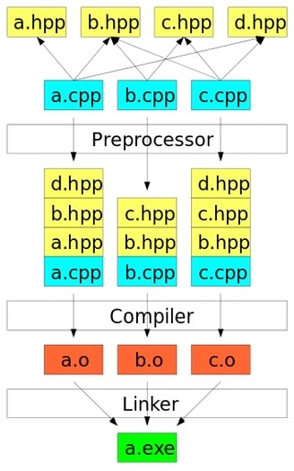
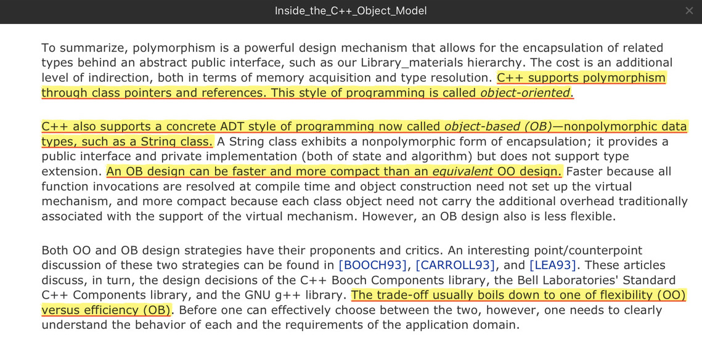
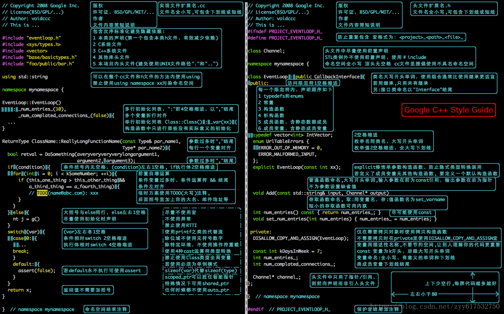
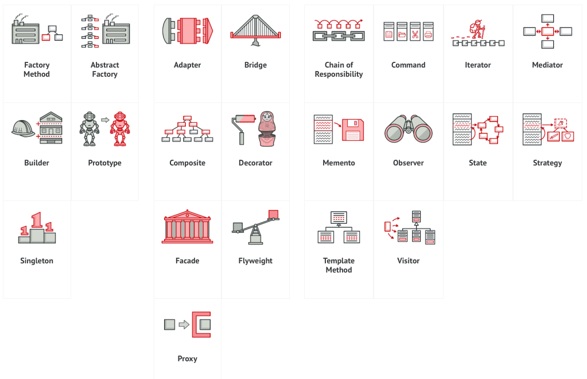

# Awesome C++
## Reading List

### Books

* [The Definitive C++ Book Guide and List](https://stackoverflow.com/questions/388242/the-definitive-c-book-guide-and-list)   
* [A Tour of C++ (2nd) `overview`](https://www.amazon.com/Tour-C-Depth-ebook/dp/B07FW7P3D3/ref=sr_1_1?crid=258SFPMIRD2L9&dchild=1&keywords=tour+of+c%2B%2B+second+edition&qid=1587085685&s=books&sprefix=A+Tour+of+C%2B%2B+second%2Cstripbooks%2C149&sr=1-1)  
* [Inside the C++ Object Model `under the hood`](https://www.amazon.com/Inside-Object-Model-Stanley-Lippman/dp/0201834545/ref=sr_1_1?dchild=1&keywords=Inside+the+C%2B%2B+Object+Model&qid=1587085658&s=books&sr=1-1)   [`中文笔记`](https://www.iteye.com/blog/dsqiu-1669614)   
* [Effective C++ (3rd) `best practices (old)`](https://www.amazon.com/Effective-Specific-Improve-Programs-Designs/dp/0321334876)    
* [Effective Modern C++ `best practices`](https://www.amazon.com/Effective-Modern-Specific-Ways-Improve/dp/1491903996)  
* [Effective STL](https://www.amazon.com/Effective-STL-Addison-Wesley-Professional-Computing-ebook/dp/B004V4432W/ref=sr_1_1?dchild=1&keywords=Effective+STL&qid=1587086496&s=books&sr=1-1)  

### Google
* [Google C++ Style Guide `guidelines`](https://google.github.io/styleguide/cppguide.html) [`中文版`](https://zh-google-styleguide.readthedocs.io/en/latest/)  
* [How To Use gflags](https://gflags.github.io/gflags/)   
* [C++ Tips of the Week](https://abseil.io/tips/)  
* [cpp-project-template](https://code.google.com/archive/p/cpp-project-template/downloads)  

### Links

* [LearnCpp.com](https://www.learncpp.com)   
* [C++ FAQ](https://isocpp.org/wiki/faq)  

### Design Patterns
* [Design Patterns for Humans `quick lookup`](https://github.com/kamranahmedse/design-patterns-for-humans)   
* [(Refactoring Guru) Design Patterns `good reference`](https://refactoring.guru/design-patterns/catalog)[`中文版`](https://refactoringguru.cn/design-patterns/catalog)  
* [(Source Making) Design Patterns `good tips`](https://sourcemaking.com/design_patterns)    


## C++ is a compiled language
[](https://www.youtube.com/watch?v=SfGuIVzE_Os&t=341s)


## C++ is a statically typed language

* Modern C++ uses `type inference`   
* Read [Effective Modern C++, Item 1-6] for the rules, and read [[Style Guide]](https://google.github.io/styleguide/cppguide.html#Type_deduction) for the guidelines   
  * Function template argument deduction    
  * `auto` (the only difference is on braced initialization)    
  * `decltype` ...   

## Self-contained Headers
* In general, every `.cc` file should have an associated `.h` file
* The `.h` files contain the declarations, while the `.cc` files contain the definitions 
* Place the declarations/definitions for `template` and `inline functions` in the header files

* All header files should be self-contained (compile on their own)  
* All header files should have `#define guards` to prevent multiple inclusion  

```cpp
#ifndef FOO_BAR_BAZ_H_  // <PROJECT>_<PATH>_<FILE>_H_
#define FOO_BAR_BAZ_H_
...
#endif  // FOO_BAR_BAZ_H_
```

* `#include` the headers you need; avoid using `forward declarations`  

## Smart Pointers
* Read [**Effective Modern C++**, Chapter 4, Item 18-22]
	* Use `std::unique_ptr` for exclusive-ownership resource management   
	* Use `std::shared_ptr` for shared-ownership resource management   
	* Use `std::weak_ptr` as `shared_ptr` that can dangle
		* caching, obeserver lists, prevention of `std::shared_ptr` cycles   
	* Prefer `std::make_unique` and `std::make_shared` to direct use of `new` (for thread-safety, efficiency)  
	* When using the Pimpl Idiom, define special member functions in the implementation file (avoid incomplete type)    

## Keyword `virtual`

* `virtual` member function is to support polymorphism;   
  - A `class` stores virtual functions in a virtual function table (`vtbl`), if any   
  - The derived class should not redefine inherited non-virtual functions       
  - The derived class can inherit, override, or introduce virtual functions    
  - The derived class must implement the pure virtual functions   
  - Explicitly annotate overrides with `override` or `final` (to catch bugs)     
  - Don't use `virtual` when declaring an `override` (to catch bugs)  
  - Polymorphic base classes normally declare virtual destructors. `virtual ~Base();`   
* `virtual inheritance` is to avoid the duplicated base class subobject that occurs with the “dreaded diamond”. 
  - Multiple implementation inheritance is strongly discouraged   
  - Where in a hierarchy should I use virtual inheritance? 
  - Just below the top of the diamond, not at the join-class.  

## Keyword `constexpr` & `const` 
* `constexpr` indicates a `compile-time` constant   
  - For objects, `constexpr` is `unconditional`    
  - For functions, `constexpr` is `conditional` on the arguements, thus avoiding code duplication    
* `const` indicates a `run-time` constant    
  - compilers use `bitwise` test to catch accidental writes, `if (a * b = c) { ... }`   
  - use `mutable` to free data members from the `bitwise` test   
  - `mutable` introduces data race for `const` memeber functions; use `atomic/mutex` for thread safety   
  - having the `non-const` member call the `const` version avoids code duplication (requires two casts: add `const` to `*this`, remove `const` from return value)    
* Use `constexpr` whenever possible (it's part of the interface, though)    
* Use `const` whenever possible  
* Prefer `const_iterator`s to `iterator`s    

## Some Tips

* Read Types Backwards

>> For people having trouble remembering the order in which `const` keyword is to be used, here's a quick tip. 
You have to read it backward, like the compiler does. For instance : 
>>
>> `const int* A;` // A is a pointer to an int that is constant  
>> `int const* A;` // A is a pointer to a const int   
>> `int* const A;` // A is a const pointer to an int  
>> `const int* const A;` // A is a const pointer to an int that is constant  
>> `T a[n];` // a is an array of n T's  
>> `T* a;`   // a is a pointer to a T  
>> `T& a;`   // a is a reference to a T  
>> `T f(A);` // f is a function, that takes an A, and returns a T  
>> `void f(const A&);` // f is a function, that takes a refernce to a const A, and returns nothing  
 
* OO (Polymorphic) vs OB (Nonpolymorphic): Use Pointers/References for Polymorphism        

>> 

* `non-static` member function uses `this` pointer; `static` member function is `this`-less  

* Use `=default` to explicitly declare the default special member functions (constrcutor, desctructor, copy operations, move operations)  

## Google C++ Style Guide
[](https://google.github.io/styleguide/cppguide.html)

## World map of STL algorithms
[](https://www.fluentcpp.com/getthemap/)

## Design Patterns
[](https://refactoring.guru/design-patterns/catalog)